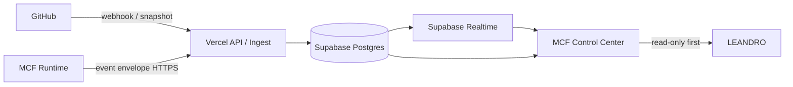

# E3 — MCF Control Center Architecture

Mission: `MCF-CONTROL-CENTER-001`
Status: `DRAFT_FOR_SPECIALIST_REVIEW`

## Objetivo

Criar um cockpit web persistente que una GitHub, MCF Runtime, ledger/evidências e infraestrutura, hospedado inicialmente em Vercel + Supabase e migrável depois para infraestrutura própria.

## Princípio central

A interface nunca é fonte de verdade. Ela projeta estado recebido de fontes verificáveis.



## Componentes

### 1. Web app
- Next.js/TypeScript hospedado inicialmente na Vercel.
- Mission Control e GitPulse tornam-se módulos da mesma aplicação.
- Nenhum secret no browser.
- Primeira versão é observadora/read-only.

### 2. Ingest/API
- Rotas server-side recebem GitHub webhooks e eventos do MCF.
- Validação de assinatura, idempotência e schema ocorre antes de persistir.
- API cria eventos imutáveis e atualiza projeções de estado atual.

### 3. Supabase/Postgres
Duas camadas de dados:
- **event ledger**: append-only, preserva o que aconteceu;
- **projections**: tabelas materializadas para leitura rápida do cockpit.

### 4. Realtime
Mudanças relevantes nas projeções são propagadas ao cockpit por Realtime. Polling fica como fallback, não como mecanismo primário.

## Schema inicial proposto

### Ledger
- `source_events`
- `ingest_receipts`

### MCF projections
- `missions`
- `mission_phases`
- `agents`
- `skills`
- `mission_assignments`
- `handoffs`
- `gates`
- `evidence_receipts`
- `runtime_snapshots`

### GitHub projections
- `github_repositories`
- `github_pull_requests`
- `github_issues`
- `github_releases`
- `github_activity`

## Regra LIVE

Todo campo marcado LIVE deve ser rastreável a:
- `source`;
- `source_event_id` ou receipt;
- `occurred_at`;
- `received_at`;
- SHA/versão quando aplicável;
- estado de verificação.

Se a origem estiver indisponível, o UI deve exibir `STALE`, `DEGRADED` ou `UNKNOWN`, nunca simular LIVE.

## GitHub

### Curto prazo
- preservar o GitPulse como baseline funcional;
- backend faz snapshot inicial do repositório;
- corrigir métricas de issues e commits.

### Estado alvo
```mermaid
flowchart LR
  GH[GitHub] -->|Webhook| W[/api/webhooks/github]
  W --> E[(source_events)]
  E --> P[GitHub projections]
  P --> R[Realtime]
  R --> G[GitPulse UI]
```

O webhook reduz polling e rate-limit. Um job de reconciliação periódico pode conferir divergências sem ser a fonte primária.

## MCF Runtime

O runtime deve **enviar eventos para fora**; o Control Center não precisa abrir conexão de entrada no notebook/VPS.

```mermaid
flowchart LR
  MR[MCF Runtime] -->|signed POST| I[/api/ingest/mcf]
  I --> L[(source_events)]
  L --> MP[Mission projections]
  MP --> R[Realtime]
  R --> MC[Mission Control]
```

O contrato de evento está em `docs/contracts/MCF-CONTROL-EVENT-v1.md`.

## Segurança por fases

### Antes de Auth
Somente dados públicos do GitHub podem ser expostos em deployment público/preview.

### Após Auth
Dados operacionais do MCF exigem sessão/autorização. Secrets ficam exclusivamente em variáveis server-side.

### Escrita futura
Botões de comando nunca escrevem diretamente no banco para "fingir" execução. A ação deve atravessar o boundary governado do MCF e retornar receipt verificável.

## Portabilidade / futura VPS

Evitar lock-in:
- domínio e contratos em TypeScript padrão;
- PostgreSQL como armazenamento canônico;
- SQL/migrations versionados no repositório;
- URLs/credenciais por environment variables;
- adaptador de realtime separado da camada de domínio;
- nenhuma regra de negócio dependente de função proprietária da Vercel.

Migração futura:

```text
Vercel + Supabase
       ↓
mesma aplicação / mesmos contratos / mesmo PostgreSQL
       ↓
VPS + Node/Next + PostgreSQL (ou Supabase self-hosted/compatível)
```

## Estratégia de entrega

1. preservar baseline original;
2. criar shell real do Control Center;
3. integrar GitHub server-side;
4. criar Postgres/event ledger;
5. ligar Realtime;
6. integrar MCF Runtime outbound;
7. adicionar autenticação/governança;
8. somente depois habilitar comandos.

## Gates de E3

Para encerrar E3 ainda falta revisão especializada de arquitetura/segurança. O runtime local foi detectado em `127.0.0.1:3000`, porém a API exige sessão válida e respondeu `401 INVALID_SESSION`; nenhuma tentativa de contornar autenticação é autorizada.
