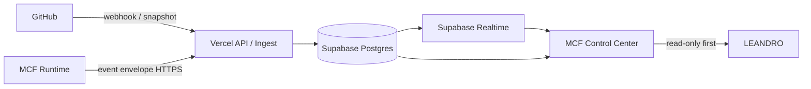

# E3 — MCF Control Center Architecture

Mission: `MCF-CONTROL-CENTER-001`
Status: `E3_RECONCILED_PENDING_EMILY`

## Objetivo

Criar um cockpit web persistente que una GitHub, MCF Runtime, ledger/evidências e infraestrutura, hospedado inicialmente em Vercel + Supabase e migrável depois para infraestrutura própria.

## Princípio central

A interface nunca é fonte de verdade. Ela projeta estado recebido de fontes verificáveis.



## Componentes

### 1. Web app
- Next.js/TypeScript hospedado inicialmente na Vercel.
- Mission Control e GitPulse tornam-se módulos da mesma aplicação.
- Nenhum secret no browser.
- Primeira versão é observadora/read-only.

### 2. Ingest/API
- Rotas server-side recebem GitHub webhooks e eventos do MCF.
- Validação de assinatura, idempotência e schema ocorre antes de persistir.
- API cria eventos imutáveis e atualiza projeções de estado atual.

### 3. Supabase/Postgres
Duas camadas de dados:
- **event ledger**: append-only, preserva o que aconteceu;
- **projections**: tabelas materializadas para leitura rápida do cockpit.

### 4. Realtime
Mudanças relevantes nas projeções são propagadas ao cockpit por Realtime. Polling fica como fallback, não como mecanismo primário.

## Schema inicial proposto

### Ledger
- `source_events`
- `ingest_receipts`

### MCF projections
- `missions`
- `mission_phases`
- `agents`
- `skills`
- `mission_assignments`
- `handoffs`
- `gates`
- `evidence_receipts`
- `runtime_snapshots` *(proposto/futuro; não existe como tabela no Runtime auditado)*

### GitHub projections
- `github_repositories`
- `github_pull_requests`
- `github_issues`
- `github_releases`
- `github_activity`

## Regra LIVE

Todo campo marcado LIVE deve ser rastreável a:
- `source`;
- `source_event_id` ou receipt;
- `occurred_at`;
- `received_at`;
- SHA/versão quando aplicável;
- estado de verificação.

Se a origem estiver indisponível, o UI deve exibir `STALE`, `DEGRADED` ou `UNKNOWN`, nunca simular LIVE.

## GitHub

### Curto prazo
- preservar o GitPulse como baseline funcional;
- backend faz snapshot inicial do repositório;
- corrigir métricas de issues e commits.

### Estado alvo
```mermaid
flowchart LR
  GH[GitHub] -->|Webhook| W[/api/webhooks/github]
  W --> E[(source_events)]
  E --> P[GitHub projections]
  P --> R[Realtime]
  R --> G[GitPulse UI]
```

O webhook reduz polling e rate-limit. Um job de reconciliação periódico pode conferir divergências sem ser a fonte primária.

## MCF Runtime

O outbound MCF → Control Center é uma **capacidade nova a implementar em E6**. O Runtime auditado ainda não possui sender HTTP/webhook; a arquitetura alvo evita conexão de entrada no notebook/VPS.

```mermaid
flowchart LR
  MR[MCF Runtime] -->|signed POST| I[/api/ingest/mcf]
  I --> L[(source_events)]
  L --> MP[Mission projections]
  MP --> R[Realtime]
  R --> MC[Mission Control]
```

O contrato de evento está em `docs/contracts/MCF-CONTROL-EVENT-v1.md`.

## Segurança por fases

### Antes de Auth
Somente dados públicos do GitHub podem ser expostos em deployment público/preview.

### Após Auth
Dados operacionais do MCF exigem sessão/autorização. Secrets ficam exclusivamente em variáveis server-side.

### Escrita futura
Botões de comando nunca escrevem diretamente no banco para "fingir" execução. A ação deve atravessar o boundary governado do MCF e retornar receipt verificável.

## Portabilidade / futura VPS

Evitar lock-in:
- domínio e contratos em TypeScript padrão;
- PostgreSQL como armazenamento canônico;
- SQL/migrations versionados no repositório;
- URLs/credenciais por environment variables;
- adaptador de realtime separado da camada de domínio;
- nenhuma regra de negócio dependente de função proprietária da Vercel.

Migração futura:

```text
Vercel + Supabase
       ↓
mesma aplicação / mesmos contratos / mesmo PostgreSQL
       ↓
VPS + Node/Next + PostgreSQL (ou Supabase self-hosted/compatível)
```

## Estratégia de entrega

1. preservar baseline original;
2. criar shell real do Control Center;
3. integrar GitHub server-side;
4. criar Postgres/event ledger;
5. ligar Realtime;
6. integrar MCF Runtime outbound;
7. adicionar autenticação/governança;
8. somente depois habilitar comandos.

## Gates de E3

Para encerrar E3 falta a auditoria final independente da EMILY sobre esta reconciliação. A implementação de infraestrutura continua bloqueada até esse gate documental; controles de exposição/ingest são gates de implementação em E4–E6. O Runtime local exige sessão válida e nenhuma tentativa de contornar autenticação é autorizada.

## E3C — Reconciliação canônica do ledger

Esta seção supersede qualquer texto anterior conflitante deste documento.

### Runtime observado

No MCF Runtime auditado:

- `mcf_events.id` é a primary key textual;
- `mcf_events.sequence` é `bigint identity unique` global da tabela;
- `mcf_events.idempotency_key` é interna ao Runtime;
- `listEvents` ordena explicitamente por `sequence ASC`;
- não existe sender outbound HTTP/webhook nas fontes auditadas;
- o enum canônico de eventos foi verificado no MCF `main@0825bbcfa1c9e8a07c08d9ff7d9ecbcc51186b22` e congelado em `docs/evidence/mcf/MCF-EVENT-TYPES-main-0825bbc.md`.

### `source_events`

Schema lógico mínimo para E4/E6:

- `event_id text primary key`;
- `source_sequence bigint not null`;
- `source text not null`;
- `event_type text not null`;
- `mission_id text null`;
- `phase_id text null`;
- `agent_id text null`;
- `occurred_at timestamptz not null`;
- `received_at timestamptz not null default now()`;
- `body jsonb not null`;
- `raw_body bytea not null`;
- `raw_body_sha256 text not null`;
- `signature_status text not null` com valores controlados (`verified`, `failed`, `not_required`);
- `transport_timestamp_ms bigint null`;
- `created_at timestamptz not null default now()`.

Para eventos `source = 'mcf-runtime'`, `signature_status = 'verified'` é obrigatório para entrada em `source_events`; `not_required` não é permitido nesse source.

Colunas promovidas são derivadas server-side do body validado. O cliente nunca envia uma segunda versão independente desses campos.

### Append-only

`source_events` é ledger imutável:

- application role recebe `INSERT/SELECT`, não `UPDATE/DELETE`;
- trigger de defesa em profundidade rejeita `UPDATE` e `DELETE`;
- correções são novos eventos/receipts, nunca mutação histórica;
- não há TTL automático no MVP.

Índices MVP:

- `(mission_id, source_sequence)` para timeline/rebuild por missão;
- `(source, received_at desc)`;
- `(event_type, received_at desc)`;
- `(occurred_at desc)` quando necessário para timeline.

Não particionar por `mission_id`. Particionamento futuro, se métricas justificarem, deve ser por tempo/data.

### `ingest_receipts`

Cada tentativa processada gera receipt append-only com, no mínimo:

- `receipt_id`;
- `source`;
- `event_id` nullable quando o payload não permite extração segura;
- `raw_body_sha256`;
- `outcome` (`accepted`, `duplicate`, `rejected`, `conflict`);
- `reason_code` nullable;
- `signature_status`;
- `transport_timestamp_ms` nullable;
- `received_at`;
- `prior_receipt_id` nullable para retry/duplicate.

MVP: sem deleção automática de receipts. Política de retenção/arquivamento só será ativada após evidência real de volume e sem comprometer auditoria.

## E3C — Idempotência e ordering

- `event_id` é a identidade no Control Center.
- Retry com mesmo `event_id` e mesmo `raw_body_sha256` é `duplicate`: não reinsere nem reaplica projeção.
- Mesmo `event_id` com body diferente é `conflict`: rejeitar e elevar anomalia.
- `source_sequence` ordena; não é idempotency key.

`mcf_events.sequence` é global da tabela. Missões intercaladas geram saltos numéricos naturais. Portanto:

- é proibido declarar perda porque `current_sequence - previous_sequence > 1` dentro de uma missão;
- eventos são persistidos mesmo se chegarem fora de ordem, desde que válidos e únicos;
- uma chegada tardia abaixo do watermark já aplicado marca a projeção `DEGRADED` e dispara rebuild/reconciliação;
- perda real só é confirmada por reconciliação contra a fonte autoritativa do Runtime.

## E3C — Semântica de saúde da projeção

`received_at` é relógio do Control Center; `occurred_at` é relógio de negócio da origem.

- **LIVE**: evento/receipt verificável, projeção reconciliada e fonte/heartbeat dentro da janela definida.
- **STALE**: último estado é verificável, porém sua atualidade excedeu a janela/heartbeat.
- **DEGRADED**: estado parcial, late event, reconciliação pendente ou fonte parcialmente disponível.
- **UNKNOWN**: não há evidência verificável suficiente para afirmar o valor.

Clock skew não é ordering. Se `occurred_at` estiver no futuro além da tolerância configurada, registrar `WARN/skew` e impedir promoção a `LIVE` até reconciliação. O valor inicial de tolerância é 5 minutos, configurável por ambiente.

## E3C — Fronteira de segurança do ingest MCF

A especificação de segurança obrigatória para `/api/ingest/mcf` é a do contrato `MCF-CONTROL-EVENT-v1.md`:

- HMAC-SHA256 cobre timestamp de transporte + raw body completo;
- assinatura obrigatória para todo evento MCF;
- replay window de 5 minutos baseada no timestamp de transporte, não em `occurredAt`;
- rotação com secret atual + anterior durante sobreposição;
- raw body/hash e signature status preservados para auditoria;
- falha fechada antes de atualizar qualquer projeção.

GitHub usa sua própria assinatura `X-Hub-Signature-256` e idempotência por delivery ID; não reutiliza o segredo MCF.

## E3C — Limite entre fechamento E3 e implementação E4–E6

O fechamento de E3 exige **especificação reconciliada e auditorada**, não implementação antecipada de toda a infraestrutura.

- **E3:** contrato, ledger, ordering, provenance, assinatura/replay e semântica LIVE definidos; EMILY audita o fechamento.
- **E4:** fundação Vercel + Supabase, migrations, Auth/RLS/server-only secrets e controles básicos de deploy.
- **E5:** GitPulse/GitHub live pode avançar usando apenas dados públicos/verificados e assinatura GitHub.
- **E6:** ingest/outbound MCF só é ativado após implementação e testes dos controles HMAC/replay/append-only/receipts definidos em E3.

Nenhum dado operacional MCF pode ser exposto publicamente antes de Auth/RLS. Nenhum comando operacional é habilitado nesta fase; HUMAN_GATE continua exclusivo de LEANDRO.

## Gate E3 reconciliado

Antes de marcar E3 como concluída:

1. parecer Pattern B de SOFIA e RAFAEL com proveniência fechada;
2. enum `McfEventType` real congelado contra o GitHub canônico;
3. BLOCKER-1 de assinatura/replay especificado no contrato;
4. BLOCKER-2 de ledger/schema/append-only especificado na arquitetura;
5. ordering global/gaps/late events reconciliados;
6. auditoria independente final da EMILY sem blocker aberto.

Até o item 6, E4 permanece `NOT_STARTED`.
